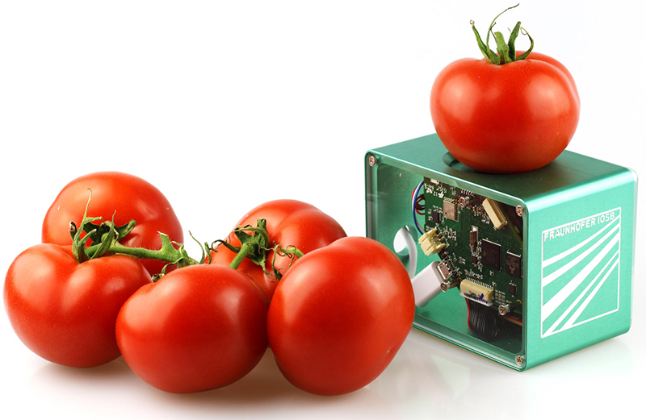

# 🍅 NIRS - NIR Spectroscopy Analysis for Tomatoes

> Analysis of tomato quality using Near-Infrared Spectroscopy (NIR)

[](https://www.python.org/)
[](https://mlflow.org/)
[](https://opensource.org/licenses/MIT)

<p align="center">
  
</p>

## 📑 Table of Contents

- [✨ Features](#-features)
- [📂 Project Structure](#-project-structure)
- [🚀 Installation](#-installation)
- [📊 Usage](#-usage)
  - [Data Processing](#data-processing)
  - [Model Training](#model-training)
  - [Running Experiments](#running-experiments)
  - [Data Visualization](#data-visualization)
- [📈 Experiment Tracking with MLflow](#-experiment-tracking-with-mlflow)
  - [Setup and Installation](#setup-and-installation)
  - [Running Experiments with MLflow](#running-experiments-with-mlflow)
  - [Viewing Results via MLflow UI](#viewing-results-via-mlflow-ui)
  - [Programmatic Usage of MLflow API](#programmatic-usage-of-mlflow-api)

## ✨ Features

- 🔍 **Pre-processing of NIR spectral data**:
  - Spectral transformations (SNV, MSC)
  - Savitzky-Golay filtering
  - Automatic detection and filtering of non-numeric columns
  - Outlier detection and removal

- 🧠 **Modeling of NIR data**:
  - PLS regression
  - Support Vector Regression (SVR)
  - Random Forest regression
  - XGBoost regression
  - LightGBM regression

- 📊 **Advanced model optimization**:
  - Hyperparameter tuning with Optuna
  - Feature selection methods
  - Genetic algorithm optimization
  - Integrated cross-validation

- 📈 **Experiment tracking with MLflow**:
  - Parameter logging
  - Metrics tracking
  - Model artifacts storage
  - Feature importance visualization

## 📂 Project Structure

```
NIRS/
├── configs/                    # Configuration files for experiments
│   ├── pls_snv_savgol.yaml     # PLS model with SNV and Savitzky-Golay
│   ├── rf_msc_feature_selection.yaml # Random Forest with feature selection
│   ├── xgb_genetic_algorithm.yaml    # XGBoost with genetic algorithm
│   └── ...                     # Other configuration files
├── data/                       # Data directory
│   ├── raw/                    # Raw input data files
│   └── processed/              # Processed data files
├── experiments/                # Experiment scripts
│   ├── analyze_models.py       # Script for analyzing model performance
│   ├── create_config.py        # Tool for creating experiment configs
│   ├── experiment_manager.py   # Manages experiment execution
│   ├── process_data.py         # Data processing utilities
│   ├── process_tomato_data.py  # Tomato-specific data processing
│   ├── run_experiment.py       # Main experiment runner
│   ├── run_from_config.py      # Run experiments from config files
│   ├── run_experiments.py      # Legacy experiment runner
│   ├── run_mlflow_server.py    # MLflow server launcher
│   └── train_model.py          # Model training script
├── images/                     # Images for documentation
├── mlruns/                     # MLflow experiment tracking data
├── models/                     # Saved model files
├── nirs_tomato/                # Main package
│   ├── config.py               # Configuration utilities
│   ├── data_processing/        # Data processing modules
│   │   ├── constants.py        # Constant definitions
│   │   ├── feature_selection.py # Feature selection methods
│   │   ├── feature_selection/  # Feature selection implementations
│   │   ├── pipeline.py         # Pipeline definitions
│   │   ├── pipeline/           # Pipeline implementations
│   │   ├── transformers.py     # Spectral transformers
│   │   └── utils.py            # Utility functions
│   ├── modeling/               # Modeling and evaluation modules
│   │   ├── evaluation.py       # Model evaluation tools
│   │   ├── hyperparameter_tuning.py # Hyperparameter optimization
│   │   ├── model_factory.py    # Model creation factory
│   │   ├── regression_models.py # Regression model implementations
│   │   └── tracking.py         # MLflow experiment tracking
│   └── __init__.py             # Package initialization
├── results/                    # Experiment results and outputs
├── tests/                      # Test files
├── docs/                       # Documentation
├── .gitignore                  # Git ignore file
├── .coverage                   # Coverage report
├── pyproject.toml              # Project configuration
└── README.md                   # This file
```

## 🚀 Installation

Clone this repository and install the package using pip:

```bash
git clone https://github.com/your-username/NIRS.git
cd NIRS
pip install -e ".[dev]"
```

## 📊 Usage

### Data Processing

The package provides tools for data processing, including transformers for spectral data, utilities for data cleaning, and pipelines for complete data processing workflows.

```python
from nirs_tomato.data_processing.transformers import SNVTransformer
from nirs_tomato.data_processing.utils import preprocess_spectra
import pandas as pd

# Load data
df = pd.read_csv('data/raw/Tomato_Viavi_Brix_model_pulp.csv')

# Process data
results = preprocess_spectra(
    df=df,
    target_column='Brix',
    transformers=[SNVTransformer()],
    exclude_columns=['Instrument Serial Number', 'Notes', 'Timestamp'],
    remove_outliers=True,
    verbose=True
)

# Get processed features and target
X = results['X']
y = results['y']
```

### Model Training

The package provides command-line scripts for model training, as well as Python functions for creating and evaluating models.

#### Using the command-line script

```bash
# Train a PLS model with SNV transformation
python experiments/train_model.py --data data/raw/Tomato_Viavi_Brix_model_pulp.csv --target Brix --model pls --transform snv

# Train an XGBoost model with MSC transformation and Savitzky-Golay filtering
python experiments/train_model.py --data data/raw/Tomato_Viavi_Brix_model_pulp.csv --target Brix --model xgb --transform msc --savgol --window_length 15 --polyorder 2 --tune_hyperparams

# Train a Random Forest model excluding specific columns
python experiments/train_model.py --data data/raw/Tomato_Viavi_Brix_model_pulp.csv --target Brix --model rf --transform snv --exclude_columns "Notes" "Timestamp" "Instrument Serial Number"
```

#### Using Python functions

```python
from nirs_tomato.modeling.model_factory import create_model
from nirs_tomato.modeling.evaluation import evaluate_regression_model
from sklearn.model_selection import train_test_split

# Split data
X_train, X_test, y_train, y_test = train_test_split(X, y, test_size=0.2, random_state=42)

# Create model
model = create_model(model_type="pls")

# Train model
model.fit(X_train, y_train)

# Evaluate model
metrics, y_pred = evaluate_regression_model(model, X_test, y_test)
print(f"R2 score: {metrics['r2_score']:.4f}")
```

### Running Experiments

The package provides multiple ways to run experiments:

#### 1. Using Configuration Files (Recommended)

The simplest way to run experiments is using YAML configuration files:

```bash
# Run a single experiment from a config file
python experiments/run_experiment.py --config configs/pls_snv_savgol.yaml

# Run all experiments in a directory
python experiments/run_experiment.py --config_dir configs/
```

You can create new configuration templates easily:

```bash
# Create a new experiment configuration
python experiments/create_config.py --name my_pls_experiment --model pls --output configs/my_pls_experiment.yaml
```

Example configuration file:

```yaml
# configs/pls_snv_savgol.yaml
experiment:
  name: PLS_SNV_SavGol
  description: PLS model with SNV and Savitzky-Golay filtering
  data:
    file_path: data/raw/Tomato_Viavi_Brix_model_pulp.csv
    target_column: Brix
    exclude_columns:
      - Instrument Serial Number
      - Notes
      - Timestamp
  preprocessing:
    transform: snv
    savgol:
      window_length: 15
      polyorder: 2
  model:
    type: pls
    n_components: 10
  evaluation:
    test_size: 0.2
    random_state: 42
    cv_folds: 5
  mlflow:
    enabled: true
```

#### 2. Using the Experiment Manager in Python

You can also run experiments programmatically:

```python
from experiments.experiment_manager import run_experiment

# Run a single experiment
results = run_experiment("configs/pls_snv_savgol.yaml")
print(f"R2 score: {results['metrics']['r2_score']:.4f}")
```

#### 3. Using the Legacy Script

The package also maintains the original script for backward compatibility:

```bash
# Run a standard set of experiments
python experiments/run_experiments.py --data data/raw/Tomato_Viavi_Brix_model_pulp.csv

# Run experiments with feature selection methods
python experiments/run_experiments.py --data data/raw/Tomato_Viavi_Brix_model_pulp.csv --feature_selection

# Track experiments with MLflow
python experiments/run_experiments.py --data data/raw/Tomato_Viavi_Brix_model_pulp.csv --use_mlflow
```

## 📈 Experiment Tracking with MLflow

The project integrates MLflow for experiment tracking, allowing you to monitor and compare model performance, hyperparameters, and feature importance.

### Setup and Installation

MLflow is already added to dependencies in `pyproject.toml`, so you just need to update the dependencies:

```bash
pip install -e ".[dev]"
```

### Running Experiments with MLflow

To track experiments through MLflow, you can use the `run_experiment.py` script with a configuration that has MLflow enabled:

```bash
# Run experiment with MLflow tracking
python experiments/run_experiment.py --config configs/pls_snv_savgol.yaml
```

Or use the legacy script:

```bash
# Run experiments with MLflow tracking
python experiments/run_experiments.py --data data/raw/Tomato_Viavi_Brix_model_pulp.csv --use_mlflow
```

### Viewing Results via MLflow UI

To launch a local MLflow server with interface:

```bash
python experiments/run_mlflow_server.py --host 127.0.0.1 --port 5000
```

Then open in browser: http://127.0.0.1:5000

### Programmatic Usage of MLflow API

The project includes a module `nirs_tomato.modeling.tracking` with functions for working with MLflow:

```python
from nirs_tomato.modeling.tracking import start_run, log_parameters, log_metrics, log_model, end_run

# Start a new experiment
start_run(run_name="experiment_name")

# Log parameters
log_parameters({"param1": value1, "param2": value2})

# Log metrics
log_metrics({"rmse": 0.123, "mae": 0.089, "r2": 0.95})

# Log model
log_model(trained_model, "model")

# End experiment
end_run()
```
